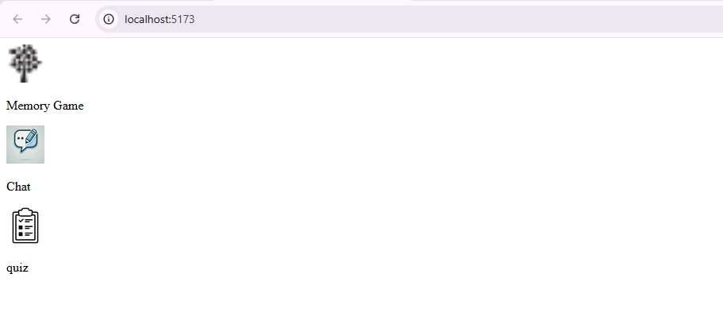
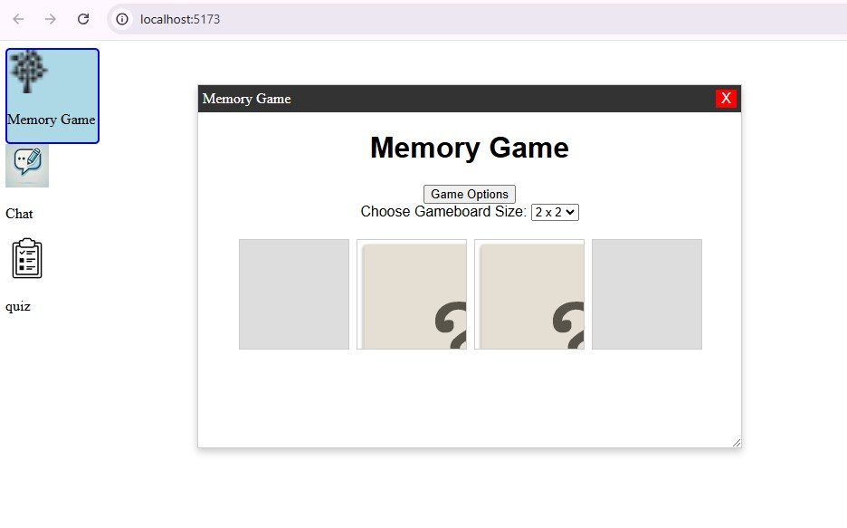
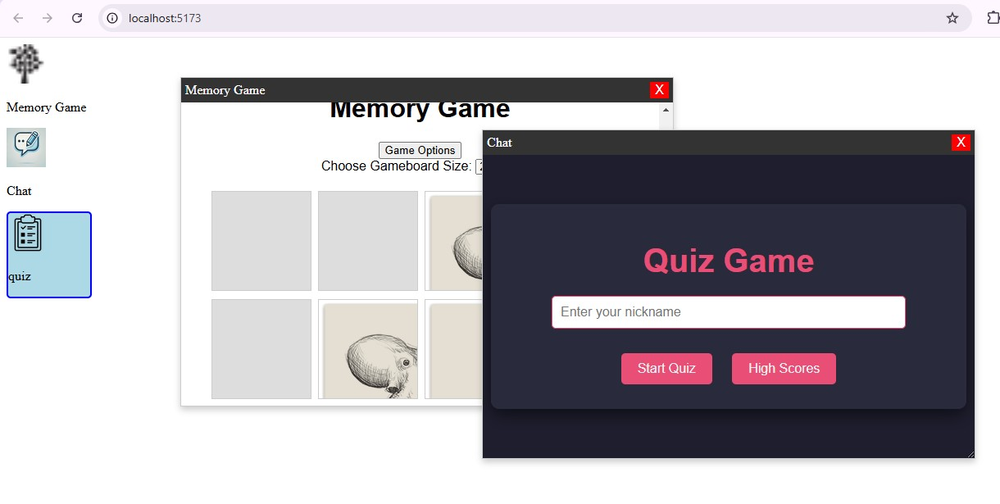
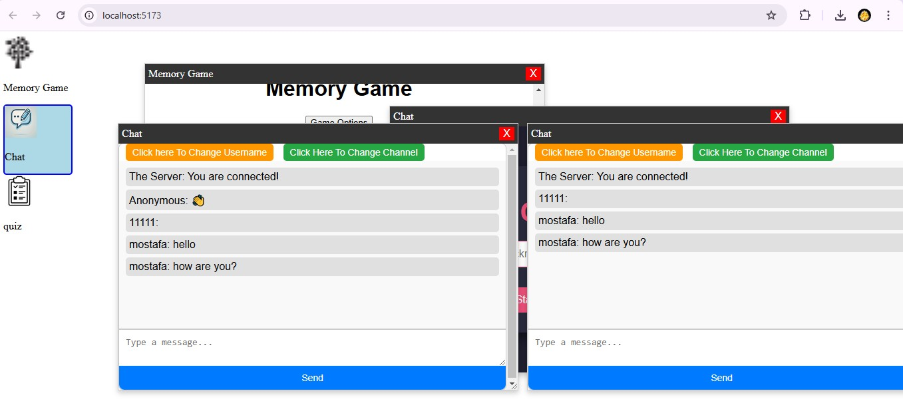

# A3 SPA

# Personal Web Desktop (PWD)



The **Personal Web Desktop (PWD)** is a web-based desktop environment that consolidates multiple mini-applications into one interactive platform. The applications include a **Memory Game**, **Chat Application**, and **Quiz Game**, each offering unique functionalities. The PWD provides a user-friendly interface with draggable windows, allowing users to manage multiple apps seamlessly in a browser environment.

---

## Features

### Memory Game
- Test your memory skills by matching pairs of cards.
- Select from various grid sizes (2x2, 2x4, 4x4).
- Keyboard navigation for accessibility.

### Chat Application
- Real-time chat powered by WebSocket.
- Customizable username and channel options.
- Supports sending messages and viewing real-time updates.

### Quiz Game
- A challenging quiz with timed questions.
- Tracks high scores and displays a leaderboard.
- Provides feedback on correct and incorrect answers.

---

## Getting Started

### Prerequisites
- A modern web browser (e.g., Chrome, Firefox, Edge).
- Node.js installed (optional, if using a local server).

### Installation

1. **Clone the repository**:
   ```bash
   git clone <repository-url>
   ```

2. **Navigate to the project folder**:
   ```bash
   cd A3-SPA
   ```

3. **Run a local server** (if required):
   - Using Node.js:
     ```bash
     npm run dev
     ```

4. **Open the application**:
   - Navigate to `http://localhost:5173` in your browser.

---

## Usage

1. **Launch the PWD**:
   Open the web page to access the desktop interface.

2. **Interact with Applications**:
   - Single-click on an icon to select it.
   - Double-click on an icon to open the respective application in a new window.

3. **Features in Action**:
   - Drag and drop windows anywhere on the screen.
   - Switch between apps by bringing windows to the front.

---

## Representative Image


 



---

## Project Structure

```
project-root/
│
├── index.html         # Main HTML file for PWD.
├── style.css          # Global styles for the desktop.
├── app.js             # Main JavaScript logic for PWD.
│
├── memory-game/       # Memory game files.
│   ├── index.html
│   ├── css/style.css
│   └── js/app.js
│
├── chat-app/          # Chat app files.
│   ├── index.html
│   ├── css/style.css
│   └── js/app.js
│
├── quiz-app/          # Quiz app files.
│   ├── index.html
│   ├── css/style.css
│   └── js/
│       ├── main.js
│       ├── quiz.js
│       ├── timer.js
│       └── highscore.js
│
└── assets/            # Images and static assets.
```

---

## Notes

- Ensure the WebSocket server is running for the chat application to function.
- For the Memory Game and Quiz Game, make sure the required images and APIs are accessible.

---

## License
This project is licensed under the MIT License.

---

## Author
- **Mustafa Tamer (mt223im)**
